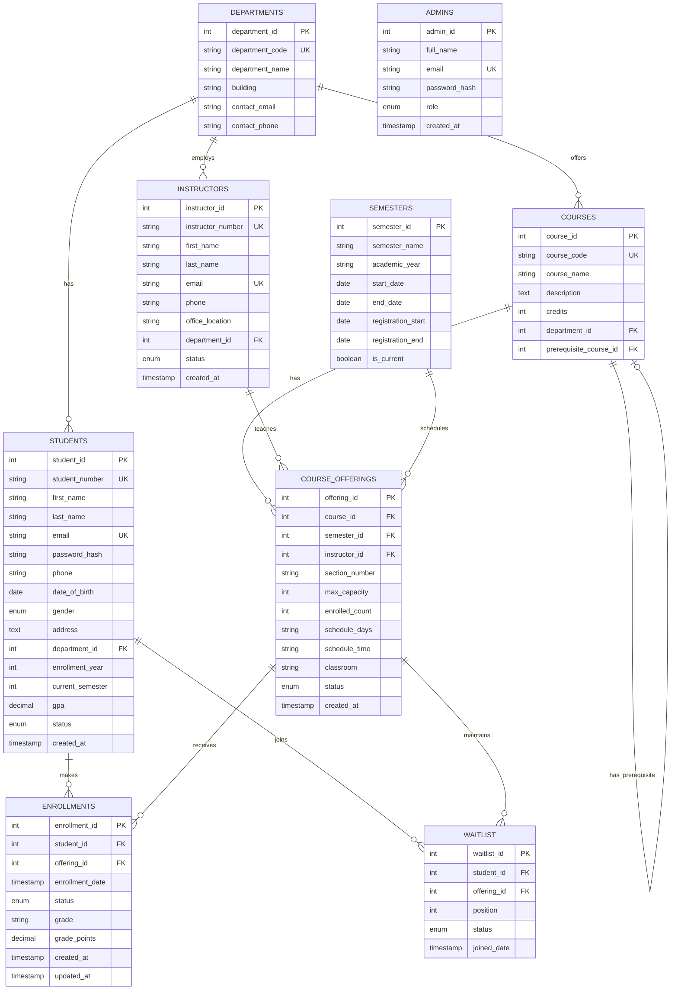

# Entity-Relationship (ER) Diagram
# Online Course Registration System

---

## 📊 Visual ER Diagram (Mermaid)



---

## 🗂️ Detailed ER Diagram (Text-Based)

### Entities and Attributes

#### 1. **STUDENTS** (Strong Entity)
- **Primary Key:** student_id
- **Unique Keys:** student_number, email
- **Attributes:**
  - student_id (INT, PK, AUTO_INCREMENT)
  - student_number (VARCHAR(20), UNIQUE)
  - first_name (VARCHAR(50))
  - last_name (VARCHAR(50))
  - email (VARCHAR(100), UNIQUE)
  - password_hash (VARCHAR(255))
  - phone (VARCHAR(20))
  - date_of_birth (DATE)
  - gender (ENUM: 'Male', 'Female', 'Other')
  - address (TEXT)
  - department_id (INT, FK → DEPARTMENTS)
  - enrollment_year (INT)
  - current_semester (INT)
  - gpa (DECIMAL(3,2))
  - status (ENUM: 'ACTIVE', 'INACTIVE', 'GRADUATED', 'SUSPENDED')
  - created_at (TIMESTAMP)

#### 2. **COURSES** (Strong Entity)
- **Primary Key:** course_id
- **Unique Keys:** course_code
- **Attributes:**
  - course_id (INT, PK, AUTO_INCREMENT)
  - course_code (VARCHAR(20), UNIQUE)
  - course_name (VARCHAR(100))
  - description (TEXT)
  - credits (INT)
  - department_id (INT, FK → DEPARTMENTS)
  - prerequisite_course_id (INT, FK → COURSES, NULLABLE)

#### 3. **INSTRUCTORS** (Strong Entity)
- **Primary Key:** instructor_id
- **Unique Keys:** instructor_number, email
- **Attributes:**
  - instructor_id (INT, PK, AUTO_INCREMENT)
  - instructor_number (VARCHAR(20), UNIQUE)
  - first_name (VARCHAR(50))
  - last_name (VARCHAR(50))
  - email (VARCHAR(100), UNIQUE)
  - phone (VARCHAR(20))
  - office_location (VARCHAR(100))
  - department_id (INT, FK → DEPARTMENTS)
  - status (ENUM: 'ACTIVE', 'INACTIVE')
  - created_at (TIMESTAMP)

#### 4. **DEPARTMENTS** (Strong Entity)
- **Primary Key:** department_id
- **Unique Keys:** department_code
- **Attributes:**
  - department_id (INT, PK, AUTO_INCREMENT)
  - department_code (VARCHAR(10), UNIQUE)
  - department_name (VARCHAR(100))
  - building (VARCHAR(50))
  - contact_email (VARCHAR(100))
  - contact_phone (VARCHAR(20))

#### 5. **SEMESTERS** (Strong Entity)
- **Primary Key:** semester_id
- **Attributes:**
  - semester_id (INT, PK, AUTO_INCREMENT)
  - semester_name (VARCHAR(50))
  - academic_year (VARCHAR(20))
  - start_date (DATE)
  - end_date (DATE)
  - registration_start (DATE)
  - registration_end (DATE)
  - is_current (BOOLEAN)

#### 6. **COURSE_OFFERINGS** (Associative/Weak Entity)
- **Primary Key:** offering_id
- **Foreign Keys:** course_id, semester_id, instructor_id
- **Attributes:**
  - offering_id (INT, PK, AUTO_INCREMENT)
  - course_id (INT, FK → COURSES)
  - semester_id (INT, FK → SEMESTERS)
  - instructor_id (INT, FK → INSTRUCTORS)
  - section_number (VARCHAR(10))
  - max_capacity (INT)
  - enrolled_count (INT, DEFAULT 0)
  - schedule_days (VARCHAR(50))
  - schedule_time (VARCHAR(50))
  - classroom (VARCHAR(50))
  - status (ENUM: 'OPEN', 'CLOSED', 'CANCELLED')
  - created_at (TIMESTAMP)

#### 7. **ENROLLMENTS** (Associative Entity)
- **Primary Key:** enrollment_id
- **Foreign Keys:** student_id, offering_id
- **Attributes:**
  - enrollment_id (INT, PK, AUTO_INCREMENT)
  - student_id (INT, FK → STUDENTS)
  - offering_id (INT, FK → COURSE_OFFERINGS)
  - enrollment_date (TIMESTAMP)
  - status (ENUM: 'ENROLLED', 'DROPPED', 'WITHDRAWN', 'COMPLETED')
  - grade (VARCHAR(2), NULLABLE)
  - grade_points (DECIMAL(3,2), NULLABLE)
  - created_at (TIMESTAMP)
  - updated_at (TIMESTAMP)

#### 8. **WAITLIST** (Associative Entity)
- **Primary Key:** waitlist_id
- **Foreign Keys:** student_id, offering_id
- **Attributes:**
  - waitlist_id (INT, PK, AUTO_INCREMENT)
  - student_id (INT, FK → STUDENTS)
  - offering_id (INT, FK → COURSE_OFFERINGS)
  - position (INT)
  - status (ENUM: 'WAITING', 'ENROLLED', 'REMOVED')
  - joined_date (TIMESTAMP)

#### 9. **ADMINS** (Strong Entity - Independent)
- **Primary Key:** admin_id
- **Unique Keys:** email
- **Attributes:**
  - admin_id (INT, PK, AUTO_INCREMENT)
  - full_name (VARCHAR(100))
  - email (VARCHAR(100), UNIQUE)
  - password_hash (VARCHAR(255))
  - role (ENUM: 'SUPER_ADMIN', 'REGISTRAR', 'STAFF')
  - created_at (TIMESTAMP)

---

## 🔗 Relationships

### 1. **DEPARTMENTS ← has → STUDENTS**
- **Type:** One-to-Many (1:N)
- **Description:** A department can have many students, but a student belongs to one department
- **Foreign Key:** STUDENTS.department_id → DEPARTMENTS.department_id
- **Cardinality:** (1,1) to (0,*)
- **Participation:** Total (Student) / Partial (Department)

### 2. **DEPARTMENTS ← offers → COURSES**
- **Type:** One-to-Many (1:N)
- **Description:** A department offers many courses, but a course belongs to one department
- **Foreign Key:** COURSES.department_id → DEPARTMENTS.department_id
- **Cardinality:** (1,1) to (0,*)
- **Participation:** Total (Course) / Partial (Department)

### 3. **DEPARTMENTS ← employs → INSTRUCTORS**
- **Type:** One-to-Many (1:N)
- **Description:** A department employs many instructors, but an instructor belongs to one department
- **Foreign Key:** INSTRUCTORS.department_id → DEPARTMENTS.department_id
- **Cardinality:** (1,1) to (0,*)
- **Participation:** Total (Instructor) / Partial (Department)

### 4. **COURSES ← has_prerequisite → COURSES** (Recursive)
- **Type:** One-to-Many (1:N) - Self-Referencing
- **Description:** A course can have one prerequisite course, and a course can be prerequisite for many courses
- **Foreign Key:** COURSES.prerequisite_course_id → COURSES.course_id
- **Cardinality:** (0,1) to (0,*)
- **Participation:** Partial on both sides

### 5. **COURSES ← creates → COURSE_OFFERINGS**
- **Type:** One-to-Many (1:N)
- **Description:** A course can have many offerings (sections), but an offering is for one course
- **Foreign Key:** COURSE_OFFERINGS.course_id → COURSES.course_id
- **Cardinality:** (1,1) to (0,*)
- **Participation:** Total (Offering) / Partial (Course)

### 6. **SEMESTERS ← schedules → COURSE_OFFERINGS**
- **Type:** One-to-Many (1:N)
- **Description:** A semester can have many course offerings, but an offering is in one semester
- **Foreign Key:** COURSE_OFFERINGS.semester_id → SEMESTERS.semester_id
- **Cardinality:** (1,1) to (0,*)
- **Participation:** Total (Offering) / Partial (Semester)

### 7. **INSTRUCTORS ← teaches → COURSE_OFFERINGS**
- **Type:** One-to-Many (1:N)
- **Description:** An instructor can teach many course offerings, but an offering has one instructor
- **Foreign Key:** COURSE_OFFERINGS.instructor_id → INSTRUCTORS.instructor_id
- **Cardinality:** (1,1) to (0,*)
- **Participation:** Total (Offering) / Partial (Instructor)

### 8. **STUDENTS ← enrolls_in → COURSE_OFFERINGS** (via ENROLLMENTS)
- **Type:** Many-to-Many (M:N)
- **Description:** A student can enroll in many course offerings, and a course offering can have many students
- **Associative Entity:** ENROLLMENTS
- **Foreign Keys:** 
  - ENROLLMENTS.student_id → STUDENTS.student_id
  - ENROLLMENTS.offering_id → COURSE_OFFERINGS.offering_id
- **Cardinality:** (0,*) to (0,*)
- **Participation:** Partial on both sides
- **Attributes:** enrollment_date, status, grade, grade_points

### 9. **STUDENTS ← waits_for → COURSE_OFFERINGS** (via WAITLIST)
- **Type:** Many-to-Many (M:N)
- **Description:** A student can be on waitlist for many offerings, and an offering can have many students waiting
- **Associative Entity:** WAITLIST
- **Foreign Keys:**
  - WAITLIST.student_id → STUDENTS.student_id
  - WAITLIST.offering_id → COURSE_OFFERINGS.offering_id
- **Cardinality:** (0,*) to (0,*)
- **Participation:** Partial on both sides
- **Attributes:** position, status, joined_date

---

## 📐 ER Diagram Notation Key

### Entity Types:
- **Strong Entity:** Rectangle (e.g., STUDENTS, COURSES, DEPARTMENTS)
- **Weak Entity:** Double Rectangle (e.g., COURSE_OFFERINGS is weak relative to COURSES and SEMESTERS)
- **Associative Entity:** Diamond in Rectangle (e.g., ENROLLMENTS, WAITLIST)

### Attributes:
- **Simple Attribute:** Oval
- **Key Attribute:** Underlined (e.g., student_id)
- **Composite Attribute:** Oval with connected ovals (e.g., name = first_name + last_name)
- **Derived Attribute:** Dashed oval (e.g., enrolled_count can be derived from ENROLLMENTS)
- **Multivalued Attribute:** Double oval

### Relationships:
- **One-to-One (1:1):** Single line both sides
- **One-to-Many (1:N):** Single line one side, crow's foot other side
- **Many-to-Many (M:N):** Crow's foot both sides

### Participation:
- **Total Participation:** Double line (entity must participate)
- **Partial Participation:** Single line (entity may participate)

### Cardinality Notation:
- **(min, max)** format
- Examples:
  - (1,1) = exactly one
  - (0,1) = zero or one
  - (0,*) = zero or many
  - (1,*) = one or many

---

## 🎯 Key Design Decisions

### 1. **Weak vs Strong Entities**
- **COURSE_OFFERINGS** is designed as a weak entity because its existence depends on both COURSES and SEMESTERS
- All other entities are strong entities with their own independent existence

### 2. **Associative Entities**
- **ENROLLMENTS:** Resolves M:N relationship between STUDENTS and COURSE_OFFERINGS, adds enrollment-specific data
- **WAITLIST:** Resolves M:N relationship for waitlist functionality, tracks position and status

### 3. **Recursive Relationship**
- **COURSES.prerequisite_course_id:** Self-referencing FK allows courses to specify prerequisites
- Enables prerequisite checking during enrollment

### 4. **Denormalization Decision**
- **enrolled_count** in COURSE_OFFERINGS is denormalized for performance
- Could be derived by counting ENROLLMENTS, but stored for faster capacity checks
- Maintained via triggers (after_enrollment_insert, after_enrollment_update)

### 5. **Enum Types**
- Used for attributes with fixed set of values
- Ensures data integrity at database level
- Examples: status, gender, role, grade

---

## 📊 Cardinality Summary Table

| Relationship | Entity 1 | Cardinality | Entity 2 | Type |
|--------------|----------|-------------|----------|------|
| has | DEPARTMENTS | 1 : N | STUDENTS | 1:N |
| offers | DEPARTMENTS | 1 : N | COURSES | 1:N |
| employs | DEPARTMENTS | 1 : N | INSTRUCTORS | 1:N |
| has_prerequisite | COURSES | 1 : N | COURSES | 1:N (Recursive) |
| creates | COURSES | 1 : N | COURSE_OFFERINGS | 1:N |
| schedules | SEMESTERS | 1 : N | COURSE_OFFERINGS | 1:N |
| teaches | INSTRUCTORS | 1 : N | COURSE_OFFERINGS | 1:N |
| enrolls_in | STUDENTS | M : N | COURSE_OFFERINGS | M:N |
| waits_for | STUDENTS | M : N | COURSE_OFFERINGS | M:N |

---

## 🔍 Functional Dependencies

### STUDENTS
- student_id → student_number, first_name, last_name, email, password_hash, phone, date_of_birth, gender, address, department_id, enrollment_year, current_semester, gpa, status
- student_number → student_id (Candidate Key)
- email → student_id (Candidate Key)

### COURSES
- course_id → course_code, course_name, description, credits, department_id, prerequisite_course_id
- course_code → course_id (Candidate Key)

### INSTRUCTORS
- instructor_id → instructor_number, first_name, last_name, email, phone, office_location, department_id, status
- instructor_number → instructor_id (Candidate Key)
- email → instructor_id (Candidate Key)

### DEPARTMENTS
- department_id → department_code, department_name, building, contact_email, contact_phone
- department_code → department_id (Candidate Key)

### COURSE_OFFERINGS
- offering_id → course_id, semester_id, instructor_id, section_number, max_capacity, enrolled_count, schedule_days, schedule_time, classroom, status
- (course_id, semester_id, section_number) → offering_id (Composite Candidate Key)

### ENROLLMENTS
- enrollment_id → student_id, offering_id, enrollment_date, status, grade, grade_points
- (student_id, offering_id) → enrollment_id (Composite Candidate Key for active enrollments)

---

## 🔐 Referential Integrity Constraints

All foreign keys have the following constraints:

1. **CASCADE on DELETE:**
   - COURSE_OFFERINGS: If a course/semester/instructor is deleted, their offerings are deleted
   - ENROLLMENTS: If an offering is deleted, enrollments are deleted

2. **CASCADE on UPDATE:**
   - All foreign keys cascade updates to maintain referential integrity

3. **RESTRICT:**
   - COURSES.prerequisite_course_id: Cannot delete a course if it's a prerequisite for other courses
   - DEPARTMENTS: Cannot delete a department with associated students/courses/instructors

---

## 📈 ER Diagram Summary

- **Total Entities:** 9 (6 strong, 1 weak, 2 associative)
- **Total Relationships:** 9 (7 binary, 1 recursive, 1 ternary-like via COURSE_OFFERINGS)
- **Primary Keys:** 9
- **Foreign Keys:** 11
- **Unique Constraints:** 8
- **Triggers:** 3 (enrollment count management)
- **Views:** 3 (for complex queries)
- **Normalization:** 3NF (Third Normal Form)

---

## 🎨 Color-Coded Diagram (Conceptual)

```
┌─────────────────────────────────────────────────────────────────┐
│                    ONLINE COURSE REGISTRATION SYSTEM             │
│                         ER DIAGRAM OVERVIEW                      │
└─────────────────────────────────────────────────────────────────┘

                        ┌────────────────┐
                        │  DEPARTMENTS   │ (Blue - Core Entity)
                        └───────┬────────┘
                                │
                ┌───────────────┼───────────────┐
                │               │               │
                │               │               │
        ┌───────▼──────┐ ┌─────▼─────┐ ┌──────▼────────┐
        │   STUDENTS   │ │  COURSES   │ │ INSTRUCTORS   │ (Green - User Entities)
        └───────┬──────┘ └─────┬──────┘ └──────┬────────┘
                │               │               │
                │               │      ┌────────▼────────┐
                │               │      │   SEMESTERS     │ (Yellow - Time Entity)
                │               │      └────────┬────────┘
                │               │               │
                │        ┌──────▼───────────────▼────────┐
                │        │     COURSE_OFFERINGS          │ (Orange - Associative)
                │        └──────┬──────────────┬─────────┘
                │               │              │
        ┌───────▼───────┐ ┌────▼─────┐ ┌─────▼────────┐
        │  ENROLLMENTS  │ │ WAITLIST │ │  [CAPACITY]  │ (Red - Relationship)
        └───────────────┘ └──────────┘ └──────────────┘

                        ┌────────────────┐
                        │     ADMINS     │ (Purple - Admin Entity)
                        └────────────────┘
```

---

## 🎓 Academic Notes

This ER diagram demonstrates:

1. ✅ **Proper Entity Identification:** Clear distinction between strong, weak, and associative entities
2. ✅ **Relationship Modeling:** Various cardinalities (1:1, 1:N, M:N) appropriately used
3. ✅ **Recursive Relationship:** Course prerequisites handled correctly
4. ✅ **Normalization:** Database is in 3NF (See NORMALIZATION.md)
5. ✅ **Referential Integrity:** All foreign key constraints properly defined
6. ✅ **Real-World Modeling:** Accurately represents course registration domain
7. ✅ **Scalability:** Design supports future extensions (waitlist, multiple sections, etc.)
8. ✅ **Data Integrity:** Constraints, triggers, and enums ensure data quality

---

**This ER diagram serves as the foundation for the entire Online Course Registration System database design.**
